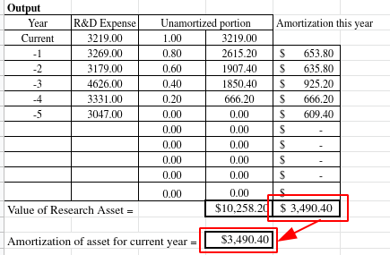
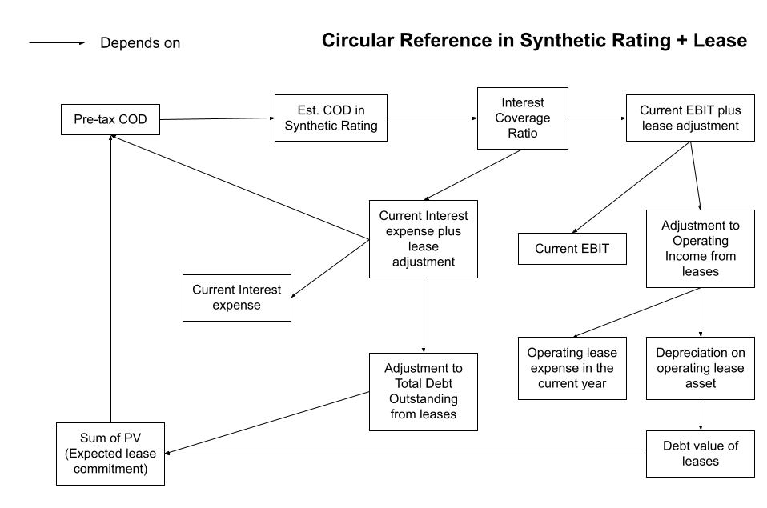
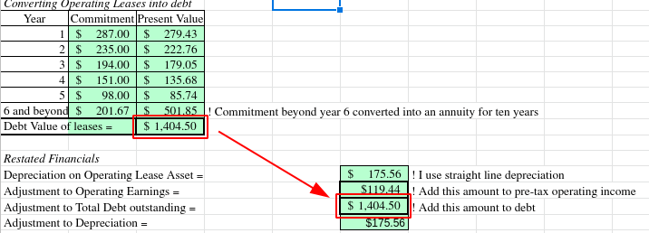
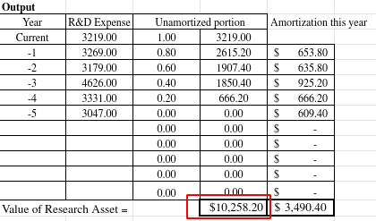

# Valuation Course
My documentation and code snippets for the Valuation Course by Prof. Aswath Damodaran.

## Cheatsheet for Intrinsic Valuation
These functions and formulas were taken directly from this Excel spreadsheet: [Valuation of GameStop (January 28, 2021)](http://www.stern.nyu.edu/~adamodar/pc/blog/GameStop2021.xlsx)

### How to read this Cheatsheet
Each component in this cheatsheet is nested at increasing levels. I have also indented with the dash (`-`) character to make the nesting a bit easier to visually distinguish.

*You may click on the heading of each component to toggle the detailed view of that component and its child components.*

Reading linearly is not advisable, you will quickly get lost once the levels reaches 10+ deep. Make use of the **Used In**, **Components**, **Details**, and **Related** links to navigate through the formulas.

---

<details open id="value-of-equity-in-common-stocks"><summary><b>-(lv1) Value of Equity in Common Stock</b></summary>

This is the final value that we are looking for. Divided by the number of shares, this becomes the Value/Share, that can be directly compared with the current price of the stock to determine whether it is under/overvalued.

```
Value of Equity in Common Stock = Value of Equity - Value of Options
```

#### Components
- [Value of Equity](#value-of-equity)
- [Value of Options](#value-of-options)

<details open id="value-of-equity"><summary><b>--(lv2) Value of Equity</b></summary>

```
Value of Equity = Value of operating assets - Debt - Minority Interests + Cash + Cash from new issue + Cross holdings and other Non-operating Assets
```

#### Used In
- [Value of Equity in Common Stocks](#value-of-equity-in-common-stocks)

#### Components

- [Value of operating assets](#value-of-operating-assets)
- [Debt](#debt)
- [Minority Interests](#minority-interests)
- [Cash](#cash)
- [Cash from new issue](#cash-from-new-issue)
- [Cross holdings and other Non-operating Assets](#cross-holdings-and-other-non-operating-assets)

<details open id="value-of-operating-assets"><summary><b>---(lv3) Value of operating assets</b></summary>

```
Value of operating assets = Sum of PV(Cash Flow) * (1 - Probability of failure) + Proceeds if Firm fails * Probability of failure
```

Probability of failure is determined qualitatively.

#### Used In
- [Value of Equity](#value-of-equity)

#### Components
- [Sum of PV(Cash Flow)](#sum-of-pv-cash-flow)

<details open id="sum-of-pv-cash-flow"><summary><b>----(lv4) Sum of PV(Cash Flow)</b></summary>

```
Sum of PV(Cash Flow) = PV(Terminal Value) + PV(Non-terminal Cash Flow)
```

#### Used In
- [Value of operating assets](#value-of-operating-assets)

#### Components
- [PV(Terminal Value)](#pv-terminal-value)
- [PV(Non-terminal Cash Flow)](#pv-non-terminal-cash-flow)


<details open id="pv-terminal-value"><summary><b>-----(lv5) PV(Terminal Value)</b></summary>

```
PV(Terminal Value) = Terminal Value * Cumulated Discount Factor
```

#### Used In
- [Sum of PV(Cash Flow)](#sum-of-pv-cash-flow)

#### Components
- [Terminal Value](#terminal-value)
- [Cumulated Discount Factor](#cumulated-discount-factor)

<details open id="terminal-value"><summary><b>------(lv6) Terminal Value</b></summary>

```
Terminal Value = Terminal Cash Flow / (Terminal Cost of Capital - Revenue Growth Rate)
```

**Terminal Cash Flow** is also known as **FCFF (Free Cash Flow to Firm) of the terminal year**.

#### Used In
- [PV(Terminal Value)](#pv-terminal-value)

#### Components
- [FCFF/Terminal Cash Flow](#fcff)
- [Terminal Cost of Capital](#terminal-coc)
- [Revenue Growth Rate](#rev-growth-rate)

<details open id="fcff"><summary><b>-------(lv7) FCFF</b></summary>

For each year, including the terminal year, the formula of FCFF is:

```
FCFF = After-tax EBIT - Reinvestment
```

#### Used In
- [Terminal Value](#terminal-value)
- [PV(Non-terminal Cash Flow)](#pv-non-terminal-cash-flow)

#### Components
- [After-tax EBIT](#after-tax-ebit)
- [Reinvestment](#reinvestment)

<details open id="after-tax-ebit"><summary><b>--------(lv8) After-tax EBIT (Earnings before Interest and Taxes)</b></summary>

There are three flavors of After-tax EBIT:

**After-tax EBIT for the first year**
This component is calculated with the following function:

```
IF EBIT > 0:
    EBIT * (1 - Tax Rate for EBIT calculation)
ELSE:
    0
```

**After-tax EBIT for the last year**
We assume the terminal year would definitely have a positive EBIT, so the After-Tax EBIT is calculated with this function:

```
After-tax EBIT = EBIT * (1 - Tax Rate for EBIT calculation)
```

**After-tax EBIT for the next year until the terminal year**
This component is calculated with the following function:

```
IF EBIT > 0:
    IF EBIT < NOL in the previous year:
        EBIT
    ELSE:
        EBIT - (EBIT - NOL in the previous year) * Tax Rate for EBIT calculation
ELSE:
    EBIT
```

Basically, this function reduces the amount used for tax calculation with the Net Operating Losses from the previous year.

The latest regulation seems to limit this amount to 80% of the EBIT, so the alternative formula would be something like:

```
IF EBIT > 0:
    IF EBIT < NOL in the previous year * 80%:
        EBIT - (EBIT * 80% * Tax Rate for EBIT calculation)
    ELSE:
        EBIT - (EBIT - NOL in the previous year * 80%) * Tax Rate for EBIT calculation
ELSE:
    EBIT
```

#### Used In
- [FCFF](#fcff)

#### Components
- [EBIT](#ebit)
- [NOL](#nol)
- [Tax Rate for EBIT calculation](#tax-rate-for-ebit-calculation)

<details open id="ebit"><summary><b>---------(lv9) EBIT (or Operating Income - depending on the valuation style)</b></summary>

Depending on the company style, you may use either EBIT or Operating Income. I  can't tell for sure which one was used in the GameStop valuation since the numbers are different from those in Yahoo Finance, but it was likely to be Operating Income since the "Stories to Numbers" sheet shows "Operating margin" instead of "EBIT margin".

EBIT for the first year is calculated with this function:

```
IF Have lease commitments:
    IF Have R&D to capitalize:
        Operating Income or EBIT
        + Adjustment to Operating Income from leases
        + Adjustment to Operating Income from R&D
    ELSE:
        Operating Income or EBIT
        + Adjustment to Operating Income from leases
ELSE:
    IF Have R&D to capitalize:
        Operating Income or EBIT
        + Adjustment to Operating Income from R&D
    ELSE:
        Operating Income or EBIT
```

For subsequent years until the terminal year, use the following formula:

```
EBIT = EBIT margin * Revenues
```

#### Used In
- [After-tax EBIT](#after-tax-ebit)

#### Components
- Operating Income or EBIT
- [EBIT margin](#ebit-margin)
- [Revenues](#rev)
- [Adjustment to Operating Income from leases](#adjustment-to-operating-income-from-leases)
- [Adjustment to Operating Income from R&D](#adjustment-to-operating-income-from-rnd)

#### Related
- [EBIT plus lease adjustment](#ebit-plus-lease-adjustment)

<details open id="ebit-margin"><summary><b>----------(lv10) EBIT margin</b></summary>
EBIT margin is decided qualitatively. It is unique to each company.

Here are the factors Used In the GameStop spreadsheet:

1. Revenue growth rate for next year.
   This one is purely qualitative.
2. Target Pre-tax EBIT margin (also known as target pre-tax operating margin)
   This is the EBIT as % of sales in year 10. To get this number, look at the company's current pre-tax EBIT margin and the average for the industry.
3. Year of convergence
   The year in which the current margin will converge on target.

For each "year" in the valuation (the year next to the base year is year 1) starting from year 2, set the EBIT Margin with the result of this function:
```
IF year > Year of convergence:
    use Target Pre-tax EBIT margin
ELSE:
    Target Pre-tax operating margin - ((Target Pre-tax EBIT margin - previous year's EBIT margin) / (Year of convergence - year))
```

In other words, simply grow linearly between year 2 and the terminal year, capped at **Target pre-tax EBIT margin**.

#### Used In
- [EBIT](#ebit)

</details for="(lv10) EBIT margin">
<details open id="rev"><summary><b>----------(lv10) Revenues</b></summary>

```
this year's Revenue = previous year's Revenue * (1 + Revenue growth rate)
```

#### Used In
- [EBIT](#ebit)
- [Pre-terminal Reinvestment](#pre-terminal-reinvestment)

#### Components
- Target Pre-tax EBIT margin
- Year of convergence
- [Revenue growth rate](#rev-growth-rate)

<details open id="rev-growth-rate"><summary><b>-----------(lv11) Revenue growth rate</b></summary>

Just like EBIT margin growth, the Revenue growth rates are decided qualitatively throughout the years.

In the GameStop's case, it was set at a constant 2% from year 2 all the way through the terminal year. In the case Amazon in the 2000's, it started at 150% and grow half each year down to a stable growth value of 6% in the terminal year.

#### Used In
- [Revenues](#rev)
- [Terminal Reinvestment](#terminal-reinvestment)
- [Terminal Value](#terminal-value)

</details for="(lv11) Revenue growth rate">
</details for="(lv10) Revenues">

<details open id="adjustment-to-operating-income-from-leases"><summary><b>----------(lv10) Adjustment to Operating Income from leases</b></summary>

```
Adjustment to Operating Income from leases = Operating lease expense in the current year - Depreciation on Operating Lease Asset
```

#### Used In
- [EBIT](#ebit)
- [EBIT plus lease adjustment](#ebit-plus-lease-adjustment)

#### Components
- Operating lease expense in the current year
- [Depreciation on Operating Lease Asset](#depreciation-on-operating-lease-asset)

#### Related
- [Adjustment to Total Debt Outstanding from leases](#adjustment-to-total-debt-outstanding-from-leases)

<details open id="depreciation-on-operating-lease-asset"><summary><b>-----------(lv11) Depreciation on Operating Lease Asset</b></summary>

```
Depreciation on Operating Lease Asset = Debt Value of Leases / (Number of years the lease is known + Number of years embedded in the lease estimation)
```

#### Used In
- [Adjustment to Operating Income from leases](#adjustment-to-operating-income-from-leases)

#### Components
- [Debt Value of Leases / Adjustment to Total Debt outstanding from leases](#adjustment-to-total-debt-outstanding-from-leases)
- Number of years the lease is known
- [Number of years embedded in the lease estimation](#number-of-years-embedded-in-the-lease-estimation)

</details for="(lv11) Depreciation on Operating Lease Asset">
</details for="(lv10) Adjustment to Operating Income from leases">

<details open id="adjustment-to-operating-income-from-rnd"><summary><b>----------(lv10) Adjustment to Operating Income from R&D</b></summary>

```
Adjustment to Operating Income from R&D = Current year's R&D expense - Amortization of R&D Asset for the current year
```

#### Used In
- [EBIT](#ebit)

#### Components
- Current year's R&D expense
- [Amortization of R&D Asset for the current year](#amortization-of-rnd-asset-for-the-current-year)

#### Related
- [Value of Research Assets](#value-of-research-assets)

<details open id="amortization-of-rnd-asset-for-the-current-year"><summary><b>-----------(lv11) Amortization of R&D Asset for the current year</b></summary>

This value is calculated for the assumed length of R&D lifetime with the formula of

```
Amortization of R&D Asset for the current year = sum of Amortized portion of R&D Expenses from previous years
```

To calculate the **Amortized portion of R&D Expenses from previous years**, we multiply each year's expense from the previous assumed R&D lifetime by the assumed amortization rate `1 / R&D lifetime`.

For example, if the length of R&D lifetime is assumed to be five years, then each amortized portion of the previous five years is `R&D Expense * (1 / 5)`.

Here is the table display for this calculation:



#### Used In
- [Adjustment to Operating Income from R&D](#adjustment-to-operating-income-from-rnd)

#### Related
- [Unamortized portion of R&D Expenses](#unamortized-portion-of-rnd-expenses)

</details for="(lv11) Amortization of R&D Asset for the current year">
</details for="(lv10) Adjustment to Operating Income from R&D">
</details for="(lv9) EBIT">

<details open id="nol"><summary><b>---------(lv9) NOL (Net Operating Losses)</b></summary>
The company may have Net Operating Losses from prior years that may be used to reduce tax calculations for the subsequent years.

#### Used In
- [After-tax EBIT](#after-tax-ebit)

</details for="(lv9) NOL">

<details open id="tax-rate-for-ebit-calculation"><summary><b>---------(lv9) Tax Rate for EBIT calculation</b></summary>

In the spreadsheet, the tax rates for the first five years are constant, set to the **Effective Tax Rate**, and then increase/decrease linearly until the terminal year.
To determine the tax rate for the terminal year, use the following conditional operator:

The first assumption is the effective tax rate will adjust to the result of this function:
```
IF assume the effective tax rate will adjust to the marginal tax rate in the terminal year?
    use Marginal Tax Rate
ELSE:
    use Effective Tax Rate
```

#### Used In
- [EBIT](#ebit)

</details for="(lv9) Tax Rate for EBIT calculation">
</details for="(lv8) After-tax EBIT">

<details open id="reinvestment"><summary><b>--------(lv8) Reinvestment</b></summary>

Reinvestments are calculated differently for the terminal year and pre-terminal years. For our purposes, Reinvestment in the terminal year is called **Terminal Reinvestment** and before it **Pre-terminal Reinvestment**.

#### Used In
- [FCFF](#fcff)

#### Details
- [Pre-terminal Reinvestment](#pre-terminal-reinvestment)
- [Terminal Reinvestment](#terminal-reinvestment)

<details open id="pre-terminal-reinvestment"><summary><b>---------(lv9) Pre-terminal Reinvestment</b></summary>

Reinvestment for subsequent years after the base year (but before the terminal year) is the result of the following function:
```
IF this year's Revenue > previous year's Revenue:
    (this year's Revenue - previous year's Revenue) / Sales to Capital Ratio
ELSE:
    0
```

#### Used In
- [Reinvestment](#reinvestment)
- [FCFF](#fcff)

#### Components
- [Revenues](#rev)
- [Sales to Capital Ratio](#sales-to-capital-ratio)

<details open id="sales-to-capital-ratio"><summary><b>----------(lv10) Sales to Capital Ratio</b></summary>

A ratio that tells us how efficient the company converts their capital to sales. Look at the industry averages in the worksheet or consult this page: [Capital Expenditures by Sector (US)](http://pages.stern.nyu.edu/~adamodar/New_Home_Page/datafile/capex.html)

#### Used In
- [Pre-terminal Reinvestment](pre-terminal-reinvestment)

</details for="(lv10) Sales to Capital Ratio">
</details for="(lv9) Pre-terminal Reinvestment">
<details open id="terminal-reinvestment"><summary><b>---------(lv9) Terminal Reinvestment</b></summary>

Reinvestment in the terminal year is determined with the following function:

```
IF Revenue growth rate in the terminal year > 0:
    (Revenue growth rate in the terminal year / ROIC in the terminal year) * After-tax EBIT
ELSE:
    0
```

#### Used In
- [Reinvestment](#reinvestment)
- [FCFF](#fcff)

#### Components
- [Revenue growth rate](#rev-growth-rate) in the terminal year
- [Terminal ROIC](#terminal-roic)

<details open id="roic"><summary><b>----------(lv10) ROIC (Return on Invested Capital)</b></summary>

The ROICs are calculated and treated differently before and in the terminal year.

Terminal ROIC is determined first, and then calculate other parts of the DCF valuation. Earlier years' ROICs are then calculated after the Invested Capital and After-tax EBIT are calculated.

#### Used In
- [Terminal Reinvestment](terminal-reinvestment)

#### Details
- [Terminal ROIC](#terminal-roic)
- [Pre-terminal ROIC](#pre-terminal-roic)

<details open id="terminal-roic"><summary><b>-----------(lv11) Terminal ROIC</b></summary>

Start by determining the ROIC for the terminal year with the following function:

The default assumption is the firm will earn a "Return on Capital" equal to its "Cost of Capital" at maturity. This assumes that whatever competitive advantages the company has today will fade over time.
```
IF override fading competitive advantages assumption:
    use Expected ROIC at Maturity
ELSE:
    use Cost of Capital at the year before the terminal year
```

#### Used In
- [Terminal Reinvestment](terminal-reinvestment)
- [ROIC (Return on Invested Capital)](#roic)

#### Components
- [Cost of Capital](#coc)

<details open id="coc"><summary><b>------------(lv12) Cost of Capital (COC)</b></summary>

Control the year 1 and terminal year Cost of Capital. For the years between year 1 and the terminal year, qualitatively determine the growth function.

- Year 1's Cost of Capital is called **Initial Cost of Capital**.
- Cost of Capital in the terminal year is called **Terminal Cost of Capital**

#### Used In
- [ROIC](#roic)

#### Components
- [Initial Cost of Capital](#initial-coc)
- [Terminal Cost of Capital](#terminal-coc)

<details open id="initial-coc"><summary><b>-------------(lv13) Initial Cost of Capital</b></summary>

Either enter as a setting or use the "Cost of capital worksheet" to determine its value.

In the "Cost of capital worksheet", the formula for the Cost of Capital is as follows:

```
Cost of Capital (COC) = Weight of Equity in COC * Cost of Equity + Weight of Debt in COC * Cost of Debt + Weight of Preferred Stock in COC * Cost of Preferred Stock
```

#### Used In
- [Cost of Capital](#coc)

#### Components
- [Weight of Equity in COC](#weight-of-equity-in-coc)
- [Cost of Equity](#coe)
- [Weight of Debt in COC](#weight-of-debt-in-coc)
- [Cost of Debt](#cod)
- [Weight of Preferred Stock in COC](#weight-of-preferred-stock-in-coc)
- [Cost of Preferred Stock](#cop)

<details open id="weight-of-equity-in-coc"><summary><b>--------------(lv14) Weight of Equity in COC</b></summary>

```
Weight of Equity in COC = Market Value of Equity / Market Value of Capital Structure
```

#### Used In
- [Initial Cost of Capital](#initial-coc)

#### Components
- [Market Value of Equity](#market-value-of-equity)
- [Market Value of Capital Structure](#market-value-of-capital-structure)

<details open id="market-value-of-equity"><summary><b>---------------(lv15) Market Value of Equity</b></summary>
Market Value of Equity is just the Market Cap, that is,

```
Market Value of Equity = Number of Shares Outstanding * Current Market Price per Share
```

#### Used In
- [Weight of Equity in COC](#weight-of-equity-in-coc)
- [Market Value of Capital Structure](#market-value-of-capital-structure)
- [Levered Beta for Equity](#levered-beta-for-equity)

</details for="(lv15) Market Value of Equity">

<details open id="market-value-of-capital-structure"><summary><b>---------------(lv15) Market Value of Capital Structure</b></summary>

This component is composed of the total market cap and liabilities of a company.

```
Market Value of Capital Structure = Market Value of Equity + Market Value of Debt + Market Value of Preferred Stock
```

#### Used In
- [Weight of Equity in COC](#weight-of-equity-in-coc)
- [Weight of Debt in COC](#weight-of-debt-in-coc)
- [Weight of Preferred Stock in COC](#weight-of-preferred-stock-in-coc)

#### Components
- [Market Value of Equity](#market-value-of-equity)
- [Market Value of Debt](#market-value-of-debt)
- [Market Value of Preferred Stock](#market-value-of-preferred-stock)

</details>

</details for="(lv14) Weight of Equity in COC">

<details open id="coe"><summary><b>--------------(lv14) Cost of Equity (COE)</b></summary>

```
Cost of Equity = Riskfree Rate + Levered Beta for Equity * ERP used in COC
```

#### Used In
- [Initial Cost of Capital](#initial-coc)

#### Components
- [Riskfree Rate](#riskfree-rate)
- [Levered Beta for Equity](#levered-beta-for-equity)
- [ERP used in COC](#erp-used-in-coc)

<details open id="riskfree-rate"><summary><b>---------------(lv15) Riskfree Rate</b></summary>
This should be today's long term riskfree rate. If you are working with a currency where the government has default risk, clean up the government bond rate to make it riskfree (by subtracting the default spread for the government).

#### Used In
- [Cost of Equity](#coe)

</details for="(lv15) Riskfree Rate">

<details open id="levered-beta-for-equity"><summary><b>---------------(lv15) Levered Beta for Equity</b></summary>

Levered beta for equity is the beta Used In the Cost of Equity calculation.

If not direct input, use the unlevered beta calculated above for the levered beta calculation.

```
IF "Direct Input":
    Use Levered Beta
ELSE:
    Unlevered Beta * (1+(1-Marginal Tax Rate)*(Market Value of Debt / Market Value of Equity)))
```

#### Used In
- [Cost of Equity](#coe)
- [Pre-tax Cost of Debt](#ptx-cod)
- [Estimated COD in Synthetic Rating](#estimated-cod-in-synthetic-rating)

#### Components
- [Unlevered Beta](#unlevered-beta)
- [Market Value of Debt](#market-value-of-debt)
- [Market Value of Equity](#market-value-of-equity)

<details open id="unlevered-beta"><summary><b>----------------(lv16) Unlevered Beta</b></summary>

```
IF "Single Business(US)":
    Lookup "Industry Name" in the "Industry Average Beta (US)" to find "Unlevered Beta"
ELSE IF "Multibusiness(US)":
    Get the weighted average of Unlevered Beta in the "Multi Business (US Industry Averages)" table
ELSE IF "Single Business(Global)":
    Lookup "Industry Name" in the "Industry Average Beta (Global)" to find "Unlevered Beta"
ELSE:
    Get the weighted average of Unlevered Beta in the "Multi Business (Global Industry Averages)" table
```

To get the weighted average, first calculate the **Estimated Value** for each business by its **Revenues**:

```
Estimated Value for a business = Revenues for that business * EV/Sales for that Business
```

And then,

```
Weighted Average of Unlevered Beta = Sum(Unlevered Beta for a business * Estimated Values for that business / sum of Estimated Values for all businesses)
```

The EV/Sales can be looked up from the "Industry Average Beta (US/Global)" sheets.


#### Used In
- [Levered Beta for Equity](#levered-beta-for-equity)

</details for="(lv16) Unlevered Beta">

<details open id="market-value-of-debt"><summary><b>----------------(lv16) Market Value of Debt</b></summary>

This is not a commonly available information. Here is how to estimate Market Value of Debt in the above formula:

```
Est. Market Value of Debt = Est. Market Value of Straight Debt + Est. Market Value of Straight Debt in Convertible + Value of Debt in Operating Leases
```

#### Used In
- [Levered Beta for Equity](#levered-beta-for-equity)
- [Market Value of Capital Structure](#market-value-of-capital-structure)
- [Weight of Debt in COC](#weight-of-debt-in-coc)

#### Components
- [Est. Market Value of Straight Debt](#est-market-value-of-straight-debt)
- [Est. Market Value of Straight Debt in Convertible](#est-market-value-of-straight-debt-in-convertible)
- [Value of Debt in Operating Leases](#value-of-debt-in-operating-leases)

<details open id="est-market-value-of-straight-debt"><summary><b>-----------------(lv17) Est. Market Value of Straight Debt</b></summary>

```
Est. Market Value of Straight Debt =
Interest Expense * (1 - (1 + Pre-tax Cost of Debt) ** (-Average Maturity)) / Interest Expense
+ Book Value of Straight Debt / (1 + Pre-Tax Cost of Debt) ** Average Maturity
```

- Average Maturity is generally found in the footnotes of financial statements.
- Book Value of Straight Debt is also commonly known as "Total Debt" in the Balance Sheet (at least in Yahoo Finance).

#### Used In
- [Market Value of Debt](#market-value-of-debt)

#### Components
- [Pre-tax Cost of Debt](#ptx-cod)

<details open id="ptx-cod"><summary><b>------------------(lv18) Pre-tax Cost of Debt</b></summary>

```
IF Approach for estimating Pre-tax COD = "Direct Input":
    Direct input of Pre-tax Cost of Debt
ELSE IF Approach for estimating Pre-tax COD = "Synthetic Rating":
    Estimated COD in Synthetic Rating
ELSE (IF Approach for estimating Pre-tax COD = "Actual Rating"):
    Rating Spread = Lookup "actual rating" in the rating spread table in the "Synthetic Rating" to get "rating spread"
    Pre-tax Cost of Debt = Risk-free Rate + Rating Spread
```

#### Used In
- [Est. Market Value of Straight Debt](#est-market-value-of-straight-debt)
- [Est. Market Value of Straight Debt in Convertible](#est-market-value-of-straight-debt-in-convertible)
- [Cost of Debt](#cod)
- [PV of Expected lease commitments](#pv-of-expected-lease-commitments)
- [Interest Expense plus lease adjustment](#interest-expense-plus-lease-adjustment)

#### Components
- [Estimated COD in Synthetic Rating](#estimated-cod-in-synthetic-rating)
- [Riskfree Rate](#riskfree-rate)

<details open id="estimated-cod-in-synthetic-rating"><summary><b>-------------------(lv19) Estimated COD in Synthetic Rating</b></summary>

```
  Estimated Cost of Debt = Risk-free Rate + Estimated Company Default Spread + Estimated Country Default Spread (if any)
```

The calculation of this component will lead to a circular reference problem for the case where the firm has a lease commitment, since the lease adjustment requires Cost Of Debt to calculate.

The circular dependency issue is as illustrated below:



To deal with this circular dependency issue, we iterate the calculation of Estimated COD in Synthetic Rating until the Pre-tax COD converges. The initial value of the Pre-tax COD is set to the `Riskfree Rate + Estimated Country Default Spread`.

#### Used In
- [Pre-tax Cost of Debt](#ptx-cod)

#### Components
- [Riskfree Rate](#riskfree-rate)
- [Estimated Company Default Spread](#estimated-company-default-spread)
- [Estimated Country Default Spread (if any)](#estimated-country-default-spread-if-any)

#### Related
- [Interest Coverage Ratio](#interest-coverage-ratio)

<details open id="estimated-company-default-spread"><summary><b>--------------------(lv20) Estimated Company Default Spread</b></summary>

The formula depends on whether the company has a large market cap (> \\$5billion) or small market cap (< \\$5billion or volatile earnings or is in risky business)

```
IF Large Market Cap:
    Lookup "Interest Coverage Ratio" in the large manufacturing firms table to get "spread"
ELSE IF Small Market Cap:
    Lookup "Interest Coverage Ratio" in the smaller and riskier firms table to get "spread"
ELSE:
    (there is a missing reference in the spreadsheet)
```

The spread can be looked up from this web page: [Ratings, Interest Coverage Ratios and Default Spread](http://pages.stern.nyu.edu/~adamodar/New_Home_Page/datafile/ratings.htm)

#### Used In
- [Estimated COD in Synthetic Rating](#estimated-cod-in-synthetic-rating)

#### Components
- [Interest Coverage Ratio](#interest-coverage-ratio)

<details open id="interest-coverage-ratio"><summary><b>---------------------(lv21) Interest Coverage Ratio</b></summary>

This is the ratio that tells us how capable the earnings of the company is to pay the current interest expense. This is used in the default spread estimation (i.e. the likelihood of the company to default on their debts).

```
IF stable firm:
    IF Interest Expense plus lease adjustment = 0:
        100000
    ELSE:
        IF current EBIT plus lease adjustment < 0:
            -100000
        ELSE:
            current EBIT plus lease adjustment / current Interest Expense plus lease adjustment
ELSE:
    IF Interest Expense in terminal year plus lease adjustment = 0:
        100000
    ELSE:
        IF EBIT in terminal year plus lease adjustment < 0:
            -100000
        ELSE:
            EBIT in terminal year plus lease adjustment / Interest Expense in terminal year plus lease adjustment
```

This function will cause a circular dependency when `Approach for estimating Pre-tax COD = "Synthetic Rating"` because [EBIT plus lease adjustment](#ebit-plus-lease-adjustment) and [Adjustment to Total Debt Outstanding from leases](#adjustment-to-total-debt-outstanding-from-leases) also need [Pre-tax COD](#ptx-cod).

To deal with this circular dependency issue, we iterate the calculation of Estimated COD in Synthetic Rating until the Pre-tax COD converges. Learn more about this from the [documentation of Estimated COD in Synthetic Rating](#estimated-cod-in-synthetic-rating).

#### Used In
- [Estimated Company Default Spread](#estimated-company-default-spread)

#### Components
- [Interest Expense plus lease adjustment](#interest-expense-plus-lease-adjustment)
- [EBIT plus lease adjustment](#ebit-plus-lease-adjustment)
- Operating Income or EBIT
- Interest Expense

#### Related
- [Estimated COD in Synthetic Rating](#estimated-cod-in-synthetic-rating)

<details open id="interest-expense-plus-lease-adjustment"><summary><b>----------------------(lv22) Interest Expense plus lease adjustment (Current Interest Expense in the spreadsheet)</b></summary>

```
IF Have lease commitments:
    Interest Expense + Adjustment to Total Debt Outstanding from leases * Pre-tax COD
ELSE:
    Interest Expense
```

#### Used In
- [Interest Coverage Ratio](#interest-coverage-ratio)

#### Components
- Interest Expense
- [Adjustment to Total Debt Outstanding from leases](#adjustment-to-total-debt-outstanding-from-leases)
- [Pre-Tax COD](#ptx-cod)

</details for="(lv22) Interest Expense plus lease adjustment">

<details open id="ebit-plus-lease-adjustment"><summary><b>----------------------(lv22) EBIT plus lease adjustment (Current EBIT in the spreadsheet)</b></summary>

This is similar to the adjusted EBIT used in the current year, but without the R&D adjustment. Why is it like that? I don't know, but probably because the [default spread table](http://pages.stern.nyu.edu/~adamodar/New_Home_Page/datafile/ratings.htm) was calculated without including the R&D adjustments for the companies involved (this is purely my speculation).

The function used to determine this value is as follows:

```
IF Have lease commitments:
    Operating Income or EBIT
    + Adjustment to Operating Income from leases
ELSE:
    Operating Income or EBIT
```

#### Used in
- [Interest Coverage Ratio](#interest-coverage-ratio)

#### Components
- Operating Income or EBIT
- [Adjustment to Operating Income from leases](#adjustment-to-operating-income-from-leases)

#### Related
- [EBIT](#ebit)

</details for="(lv22) Current EBIT">
</details for="(lv21) Interest Coverage Ratio">
</details for="(lv20) Estimated Company Default Spread">

<details open id="estimated-country-default-spread-if-any"><summary><b>--------------------(lv20) Estimated Country Default Spread (if any)</b></summary>

Lookup the country the company is incorporated in in the Country equity risk premiums sheet to get Adjusted Default Spread.

#### Used In
- [Estimated COD in Synthetic Rating](#estimated-cod-in-synthetic-rating)

</details for="(lv20) Estimated Country Default Spread (if any)">
</details for="(lv19) \"Estimated Cost of Debt" in \"Synthetic Rating\"">
</details for="(lv18) Pre-tax Cost of Debt">
</details for="(lv17) Est. Market Value of Straight Debt">
<details open id="est-market-value-of-straight-debt-in-convertible"><summary><b>-----------------(lv17) Est. Market Value of Straight Debt in Convertible</b></summary>

```
Est. Market Value of Straight Debt in Convertible =
Interest Expense on Convertible * (1 - (1 + Pre-tax Cost of Debt) ** (-Maturity of Convertible Bond)) / Pre-tax Cost of Debt
+ Book Value of Convertible Debt / (1 + Pre-tax Cost Of Debt) ** Market Value of Convertible
```

#### Used In
- [Market Value of Debt](#market-value-of-debt)

#### Components
- [Interest Expense on Convertible](#interest-expense-on-convertible)
- [Pre-tax Cost of Debt](#ptx-cod)
- [Maturity of Convertible Bond](#maturity-of-convertible-bond)
- [Book Value of Convertible Debt](#book-value-of-convertible-debt)
- [Market Value of Convertible](#market-value-of-convertible)

<details open id="book-value-of-convertible-debt"><summary><b>------------------(lv18) Book Value of Convertible Debt</b></summary>

*Todo: Clarify*

From [AVC.com](https://avc.com/2011/07/financing-options-convertible-debt/):

> Convertible debt is when a company borrows money from an investor or a group of investors and the intention of both the investors and the company is to convert the debt to equity at some later date. Typically the way the debt will be converted into equity is specified at the time the loan is made. Sometimes there is compensation in the form of a discount or a warrant. Other times there is not. Sometimes there is a cap on the valuation at which the debt will convert. Other times there is not.

The typical forms of compensation for making a convertible loan are warrants or a discount.

#### Used In
- [Est. Market Value of Straight Debt in Convertible](#est-market-value-of-straight-debt-in-convertible)

</details for="(lv18) Book Value of Convertible Debt">

<details open id="interest-expense-on-convertible"><summary><b>------------------(lv18) Interest Expense on Convertible</b></summary>

*Todo: Clarify*

Interest expense on [convertible debts](#book-value-of-convertible-debt)

#### Used In
- [Est. Market Value of Straight Debt in Convertible](#est-market-value-of-straight-debt-in-convertible)

</details for="(lv18) Interest Expense on Convertible">

<details open id="maturity-of-convertible-bond"><summary><b>------------------(lv18) Maturity of Convertible Bond</b></summary>

*Todo: Clarify*

From [Investopedia](https://www.investopedia.com/terms/c/convertiblebond.asp):

> A convertible bond is a fixed-income corporate debt security that yields interest payments, but can be converted into a predetermined number of common stock or equity shares. The conversion from the bond to stock can be done at certain times during the bond's life and is usually at the discretion of the bondholder.

#### Used In
- [Est. Market Value of Straight Debt in Convertible](#est-market-value-of-straight-debt-in-convertible)

</details for="(lv18) Maturity of Convertible Bond">

<details open id="market-value-of-convertible"><summary><b>------------------(lv18) Market Value of Convertible</b></summary>

*Todo: Clarify*

#### Used In
- [Est. Market Value of Straight Debt in Convertible](#est-market-value-of-straight-debt-in-convertible)

</details for="(lv18) Market Value of Convertible">
</details for="(lv17) Est. Market Value of Straight Debt in Convertible">
<details open id="value-of-debt-in-operating-leases"><summary><b>-----------------(lv17) Value of Debt in Operating Leases</b></summary>

```
IF Have operating lease commitments:
    "Adjustment to Total Debt Outstanding" in the "Operating Lease Converter" sheet
ELSE:
    0
```

#### Used In
- [Market Value of Debt](#market-value-of-debt)

#### Components
- [Adjustment to Total Debt Outstanding from leases](#adjustment-to-total-debt-outstanding-from-leases)

<details open id="adjustment-to-total-debt-outstanding-from-leases"><summary><b>------------------(lv18) Adjustment to Total Debt Outstanding from leases</b></summary>

To get this value, compute the `Sum of PV(Cash Flow)(expected lease commitments)`

Expected lease commitments are the expected lease expenses in the future, both for the foreseeable future and beyond that.

Here is the calculation table for this component:



Lease commitments for the foreseeable years are gathered from the financial statements, and then beyond that determined qualitatively.

#### Used In
- [Value of Debt in Operating Leases](#value-of-debt-in-operating-leases)
- [Invested Capital](#invested-capital)
- [Depreciation on Operating Lease Asset](#depreciation-on-operating-lease-asset)
- [Interest Expense plus lease adjustment](#interest-expense-plus-lease-adjustment)

#### Components
- PV of lease commitments
- [PV of Expected lease commitments](#pv-of-expected-lease-commitments)

#### Related
- [Adjustment to Operating Income from leases](#adjustment-to-operating-income-from-leases)

<details open id="pv-of-expected-lease-commitments"><summary><b>-------------------(lv19) PV of Expected lease commitments</b></summary>

PV of Expected lease commitments in the foreseeable years is calculated by the following formula:

```
PV of Expected lease commitment in a foreseeable year = Expected lease commitment for that year / (1 + Pre-tax Cost of Debt) ** Number of year in the future
```

PV of Expected lease commitments beyond the foreseeable years is determined by the following function:

```
IF Number of years embedded in the estimate > 0:
    (Expected lease commitments * (1 - (1 + Pre-tax Cost of Debt)**(-Number of years embedded in the estimate)) / Pre-tax Cost of Debt)
    / (1 + Pre-tax Cost of Debt)**(Number of years the lease is known)
ELSE:
    Expected lease commitments / (1 + Pre-tax Cost of Debt)**(Number of years the lease is known + 1)
```

#### Used In
- [Adjustment to Total Debt Outstanding from leases](#adjustment-to-total-debt-outstanding-from-leases)

#### Components
- [Expected lease commitments](#expected-lease-commitments)
- [Pre-tax Cost of Debt](#ptx-cod)
- Number of years the lease is known

<details open id="expected-lease-commitments"><summary><b>--------------------(lv20) Expected lease commitments</b></summary>

Expected lease commitments are divided into two categories:

- Leases for the foreseeable years, and
- leases beyond the foreseeable years.

For the latter, the estimation is done qualitatively, usually through some sort of average over the known number of years.


When calculating **PV of Expected lease commitments**, the lease commitments for the foreseeable years can be used directly, but the commitments beyond that must be converted into an annuity for ten years with the following function:

```
IF Expected lease commitments beyond the foreseeable years > 0:
    IF Number of years embedded in the lease estimation > 0:
        Expected lease commitments beyond the foreseeable years / Number of years embedded in the lease estimation
    ELSE:
        Expected lease commitments beyond the foreseeable years
ELSE:
    0
```

#### Used In
- [PV of Expected lease commitments](#pv-of-expected-lease-commitments)

#### components
- Expected lease commitments beyond the foreseeable years
- [Number of years embedded in the lease estimation](#number-of-years-embedded-in-the-lease-estimation)

<details open id="number-of-years-embedded-in-the-lease-estimation"><summary><b>---------------------(lv21) Number of years embedded in the lease estimation</b></summary>

This is a number that tells us how many years does the total **Expected lease commitments beyond the foreseeable years** covers, assuming that the annual lease commitments are going to be the same with the **expected lease commitments in the foreseeable years**.

```
IF Expected lease commitments beyond the foreseeable years > 0:
    ROUND(Expected lease commitments beyond the foreseeable years / AVERAGE(Expected lease commitments for the foreseeable years))
```

#### Used In
- [Expected lease commitments](#expected-lease-commitments)
- [Depreciation on Operating Lease Asset](#depreciation-on-operating-lease-asset)

#### Components
- Expected lease commitments beyond the foreseeable years
- Expected lease commitments for the foreseeable years

</details for="(lv21) Number of years embedded in the lease estimation">
</details for="(lv20) Expected lease commitments">
</details for="(lv19) PV of Expected lease commitments">
</details for="(lv18) Adjustment to Total Debt Outstanding from leases">
</details for="(lv17) Value of Debt in Operating Leases">
</details for="(lv16) Market Value of Debt">
</details for="(lv15) Levered Beta for Equity">

<details open id="erp-used-in-coc"><summary><b>---------------(lv15) ERP used in COC (Equity Risk Premium used in Cost of Capital)</b></summary>

```
IF approach is "Will Input":
    Manual input
ELSE IF approach is "Country of Incorporation":
    Lookup "Country of Incorporation" in the "Country equity risk premiums" sheet to get "Equity Risk Premium"
ELSE IF approach is "Operating regions":
    Get the "Total Weighted ERP" from the "Operating Regions ERP calculator" table
ELSE:
    Get the "Total Weighted ERP" from the "Operating Countries ERP calculator" table
```

To get the Total Weighted ERP, first calculate the weight of revenues from each country/region:

```
Weight = Revenues / Total Revenues
```

and then calculate the Weighted ERP for each country/region with the following formula:

```
Country/Region Weighted ERP = ERP for the country/region * Weight
```

The `sum(Country/Region Weighted ERP)` is the Total Weighted ERP.

The ERP can be looked up from the "Country equity risk premiums" sheet or [Country Default Spreads and Risk Premiums](http://pages.stern.nyu.edu/~adamodar/New_Home_Page/datafile/ctryprem.html) page, column "Equity Risk Premium".

#### Used In
- [Cost of Equity](#coe)

</details for="(lv15) ERP used in COC">
</details for="(lv14) Cost of Equity">

<details open id="weight-of-debt-in-coc"><summary><b>--------------(lv14) Weight of Debt in COC</b></summary>

```
Weight of Debt in COC = Market Value of Debt / Market Value of Capital Structure
```

#### Used In
- [Initial Cost of Capital](#initial-coc)

#### Components
- [Market Value of Debt](#market-value-of-debt)
- [Market Value of Capital Structure](#market-value-of-capital-structure)

</details for="(lv14) Weight of Debt in COC">

<details open id="cod"><summary><b>--------------(lv14) Cost of Debt</b></summary>

```
Cost of Debt = Pre-tax Cost of Debt * (1 - Marginal Tax Rate)
```

#### Used In
- [Initial Cost of Capital](#initial-coc)

#### Components
- [Pre-tax Cost of Debt](#ptx-cod)
- Marginal Tax Rate

</details for="(lv14) Cost of Debt">

<details open id="weight-of-preferred-stock-in-coc"><summary><b>--------------(lv14) Weight of Preferred Stock in COC</b></summary>

```
Weight of Preferred Stock in COC = Market Value of Preferred stock / Market Value of Capital Structure
```

#### Used In
- [Initial Cost of Capital](#initial-coc)

#### Components
- [Market Value of Preferred Stock](#market-value-of-preferred-stock)
- [Market Value of Capital Structure](#market-value-of-capital-structure)

<details open id="market-value-of-preferred-stock"><summary><b>---------------(lv15) Market Value of Preferred Stock</b></summary>

```
Market Value of Preferred Stock = Number of Preferred Shares * Current Market Price per Share
```

Find the Number of Preferred Shares and the Current Market Price per Share in the financial statements.

#### Used In
- [Weight of Preferred Stock in COC](#weight-of-preferred-stock-in-coc)

</details for="(lv15) Market Value of Preferred Stock">
</details for="(lv14) Weight of Preferred Stock in COC">

<details open id="cop"><summary><b>--------------(lv14) Cost of Preferred Stock</b></summary>

```
Cost of Preferred Stock = Annual Dividend per Preferred Share / Current Market Price per Preferred Share
```

Find the Annual Dividend per Preferred Share and Current Market Price per Preferred Share in the financial statements.

#### Used In
- [Initial Cost of Capital](#initial-coc)

</details for="(lv14) Cost of Preferred Stock">

</details for="(lv13) Initial Cost of Capital">
<details open id="terminal-coc"><summary><b>-------------(lv13) Terminal Cost of Capital</b></summary>

This is the Cost of Capital in the terminal year.

The default assumption is the firm will eventually have a "Cost of Capital" similar to that of typical mature companies (Riskfree Rate + Mature Market ERP).

Set the Terminal Cost of Capital to the result of the following function:
```
IF override fading risk levels:
    Manual input
ELSE:
    IF override assumption that today's Riskfree Rate will prevail in perpetuity:
        Manual input of Terminal Riskfree Rate + Mature Market ERP
    ELSE:
        Riskfree Rate + Mature Market ERP
```

To get the Mature Market ERP, find the "Total Equity Risk Premium" of United States from this page: [Country Default Spreads and Risk Premiums](http://pages.stern.nyu.edu/~adamodar/New_Home_Page/datafile/ctryprem.html).

#### Used In
- [Cost of Capital](#coc)
- [Terminal Value](#terminal-value)

#### Components
- [Riskfree Rate](#riskfree-rate)
- Terminal Riskfree Rate
- Mature Market Equity Risk Premium

</details for="(lv13) Terminal Cost of Capital">
</details for="(lv12) Cost of Capital">
</details for="(lv11) Terminal ROIC">
<details open id="pre-terminal-roic"><summary><b>-----------(lv11) Pre-terminal ROIC</b></summary>

ROIC for each year before the terminal year is calculated with the following formula:

```
this year's ROIC = this year's After-tax EBIT / Invested Capital
```

#### Used In
- [ROIC](#roic)

#### Components
- [After-tax EBIT](#after-tax-ebit)
- [Invested Capital](#invested-capital)

<details open id="invested-capital"><summary><b>------------(lv12) Invested Capital</b></summary>

```
IF Have lease commitments:
    IF Have R&D to capitalize:
        Book Value of Equity
        + Book Value of Debt
        - Cash and Marketable Securities
        + Adjustment to Total Debt Outstanding from leases
        + Value of Research Assets
    ELSE:
        Book Value of Equity
        + Book Value of Debt
        - Cash and Marketable Securities
        + Adjustment to Total Debt Outstanding from leases
ELSE:
    IF Have R&D to capitalize:
        Book Value of Equity
        + Book Value of Debt
        - Cash and Marketable Securities
        + Value of Research Assets
    ELSE:
        Book Value of Equity
        + Book Value of Debt
        - Cash and Marketable Securities
```

#### Used In
- [Pre-terminal ROIC](#pre-terminal-roic)

#### Components
- [Book Value of Equity](#equity-bv)
- [Book Value of Debt](#debt-bv)
- [Cash and Marketable Securities](#cash-and-marketable-securities)
- [Adjustment to Total Debt Outstanding from leases](#adjustment-to-total-debt-outstanding-from-leases)
- [Value of Research Assets](#value-of-research-assets)

<details open id="equity-bv"><summary><b>-------------(lv13) Book Value of Equity</b></summary>

Enter the book value of equity (total) from the end of the most recent time period (i.e. the most recent balance sheet). This book equity will include everything - paid in capital, retained earnings etc. and may even be negative for companies that have been losing money for a while.

#### Used In
- [Invested Capital](#invested-capital)

</details for="(lv13) Book Value of Equity">

<details open id="debt-bv"><summary><b>-------------(lv13) Book Value of Debt</b></summary>

Book Value of Debt is also called "Total Debt" in the balance sheet.

#### Used In
- [Invested Capital](#invested-capital)
- [Debt](#debt)

</details for="(lv13) Book Value of Debt">

<details open id="cash-and-marketable-securities"><summary><b>-------------(lv13) Cash and Marketable Securities</b></summary>

Enter the cash balance from the most recent balance sheet. This should include marketable securities.

Cash and Marketable Securities is also called "Cash, Cash Equivalents & Short Term Investments" in the balance sheet.

#### Used In
- [Invested Capital](#invested-capital)

</details for="(lv13) Cash and Marketable Securities">

<details open id="value-of-research-assets"><summary><b>-------------(lv13) Value of Research Assets</b></summary>

This is the sum of all Unamortized portion of R&D Expenses as shown here:



#### Used In
- [Invested Capital](#invested-capital)

#### Components
- [Unamortized portion of R&D Expenses](#unamortized-portion-of-rnd-expenses)

#### Related
- [Adjustment to Operating Income from R&D](#adjustment-to-operating-income-from-rnd)

<details open id="unamortized-portion-of-rnd-expenses"><summary><b>--------------(lv14) Unamortized portion of R&D Expenses</b></summary>

This value is calculated for the assumed length of R&D lifetime. For example, if the length of R&D lifetime is assumed to be five years, then get the R&D Expenses for the previous five years, reduce each year's expense with the amortized portion.

If we are calculating the value for year 2020, for instance, then the R&D Expense of year 2015 would worth 0 since 100% of its portion is amortized, followed by 20% of year 2016's R&D Expense, then 40%, all the way to 100% in the year 2020's R&D Expense.

```
Unamortized portion of R&D Expenses = R&D Expense * unamortized portion
```

#### Used In
- [Value of Research Assets](#value-of-research-assets)

#### Related
- [Amortization of R&D Asset for the current year](#amortization-of-rnd-asset-for-the-current-year)

</details for="(lv14) Unamortized portion of R&D Expenses">
</details for="(lv13) Value of Research Assets">
</details for="(lv12) Invested Capital">
</details for="(lv11) Pre-terminal ROIC">
</details for="(lv10) ROIC">
</details for="(lv9) Terminal Reinvestment">
</details for="(lv8) Reinvestment">
</details for="(lv7) FCFF">
</details for="(lv6) Terminal Value">

<details open id="cumulated-discount-factor"><summary><b>------(lv6) Cumulated Discount Factor</b></summary>

For each year in the DCF calculation, calculate the Cumulated Discount Factor as follows:

```
IF the year after the current year:
    1 / (1 + this year's COC)
ELSE:
    previous year's Cumulated Discount Factor / (1 + this year's COC)
```

#### Used In
- [PV(Terminal Value)](#pv-terminal-value)
- [PV(Non-terminal Cash Flow)](#pv-non-terminal-cashflow)

#### components
- previous year's Cumulated Discount Factor
- [Cost of Capital](#coc)

</details for="(lv6) Cumulated Discount Factor">
</details for="(lv5) PV(Terminal Value)">
<details open id="pv-non-terminal-cash-flow"><summary><b>-----(lv5) PV(Non-terminal Cash Flow)</b></summary>

```
PV(this year's FCFF) = this year's FCFF * this year's Cumulated Discount Factor
```

#### Used In:
- [Sum of PV(Cash Flow)](#sum-of-pv-cash-flow)

#### Components
- [FCFF](#fcff)
- [Cumulated Discount Factor](#cumulated-discount-factor)

</details for="(lv5) PV(CF over next 10 years)">
</details for="(lv4) Sum of PV(Cash Flow)">
</details for="(lv3) Value of operating assets">

<details open id="debt"><summary><b>---(lv3) Debt</b></summary>

```
IF Have operating lease commitments:
    Book Value of Debt + "Adjustment to Total Debt Outstanding" in the "Operating Lease Converter" sheet
ELSE:
    Book Value of Debt
```

#### Used In
- [Value of Equity](#value-of-equity)

#### Components
- [Book Value of Debt](#debt-bv)
- [Adjustment to Total Debt Outstanding from leases](#adjustment-to-total-debt-outstanding-from-leases)

</details for="(lv3) Debt">

<details open id="minority-interests"><summary><b>---(lv3) Minority Interests</b></summary>

The "market" value of minority interests. This is a uniquely accounting item and will be on the liability side of your company's balance sheet.

It reflects the requirement that if you own more than 50% of another company or have effective control of it, you have to consolidate that company's statements with yours. Thus, you count 100% of that subsidiaries assets, revenues and operating income with your company, even if you own only 60%. The minority interest reflects the book value of the 40% of the equity in the subsidiary that does not belong to you.

**It is best if you can convert the book value to a market value by applying the price to book ratio for the sector in which the subsidiary operates.**

#### Used In
- [Value of Equity](#value-of-equity)

</details for="(lv3) Minority Interests">

<details open id="cash"><summary><b>---(lv3) Cash</b></summary>


```
IF override the assumption that none of the cash is trapped in foreign currencies and there is no additional tax liability coming due and that cash is a neutral asset:
    Cash and Marketable Securities - Enter trapped cash (if taxes) or entire balance (if mistrust) * (Marginal Tax Rate - Average Tax Rate of the foreign markets where the cash is trapped)
ELSE:
    Cash and Marketable Securities
```

**Enter trapped cash (if taxes) or entire balance (if mistrust)**
If your concern is that a portion of the cash is trapped in foreign markets and will be subject to tax, when returned, enter the trapped cash balance. If you feel that the entire cash balance is being discounted because markets don't trust managers, enter the entire cash balance.

**Average Tax Rate of the foreign markets where the cash is trapped**
This is the additional tax due, if the cash is trapped cash. If your concern is that all cash is being discounted by the market because of management mistrust, enter the percentage discount to apply to cash.

#### Used In
- [Value of Equity](#value-of-equity)

#### Components
- Cash and Marketable Securities
- Trapped cash (if taxes) or entire balance (if mistrust)
- Marginal Tax rate
- Average Tax Rate of the foreign markets where the cash is trapped

</details for="(lv3) Cash">

<details open id="cash-from-new-issue"><summary><b>---(lv3) Cash from new issue</b></summary>

#### Used In
- [Value of Equity](#value-of-equity)

</details for="(lv3) Cash from new issue">

<details open id="cross-holdings-and-other-non-operating-assets"><summary><b>---(lv3) Cross holdings and other Non-operating Assets</b></summary>

Enter the market value of those non-cash assets whose earnings are (and will never) show up as part of operating income.

The most common non-operating assets are minority holdings in other companies (which are not consolidated). You can find the book value of these holdings on the balance sheet, but see if you can convert to market value. (I apply a price to book ratio, based on the sector that the company is in to the book value).

#### Used In
- [Value of Equity](#value-of-equity)

</details for="(lv3) Cross holdings and other Non-operating Assets">
</details for="(lv2) Value of Equity">

<details open id="value-of-options"><summary><b>--(lv2) Value of Options</b></summary>

```
IF Have employee options outstanding:
    "Value of all options outstanding" in the "Option value" sheet
ELSE:
    0
```

#### Used In
- [Value of Equity in Common Stock](#value-of-equity-in-common-stock)

#### Components
- [Value of all options outstanding](#value-of-all-options-outstanding)

<details open id="value-of-all-options-outstanding"><summary><b>---(lv3) Value of all options outstanding</b></summary>

```
Value of all options outstanding = Value per option * Number of warrants (options) outstanding
```

#### Used In
- [Value of Options](#value-of-options)

#### Components
- [Value per option](#value-per-option)
- [Number of warrants (options) outstanding](#number-of-options-outstanding)

<details open id="value-per-option"><summary><b>----(lv4) Value per Option</b></summary>

Use the Black-Scholes model to value the options.

```
Value per Option = (e**((0 - Annualized dividend yield on stock) * Option expiration (in years)))
                 * Adjusted S * NORMSDIST(d1)
                 - Option Strike Price * (e**((0 - T. Bond Rate) * Option expiration (in years))) * NORMSDIST(d2)
```

#### Used In
- [Value of all options outstanding](#value-of-all-options-outstanding)

#### Components
- Annualized dividend yield on stock
- Option expiration (in years)
- [Black-Scholes - Adjusted S](#black-scholes-adjusted-s)
- [NORMSDIST](#normsdist)
- [Black-Scholes - d1](#black-scholes-d1)
- Option Strike Price - This is also known as Adjusted K
- [T. Bond Rate (use Riskfree rate for this)](#riskfree-rate)
- [Black-Scholes - d2](#black-scholes-d2)

<details open id="black-scholes-adjusted-s"><summary><b>-----(lv5) Black-Scholes - Adjusted S</b></summary>

```
Adjusted S = (Stock Price * Number of Shares outstanding + Value per Option * Number of Warrants) / (Number of Shares outstanding + Number of Warrants)
```

This formula would cause a circular dependency error. Solve it with iterative calculation.

#### Used In
- [Value per Option](#value-per-option)

#### Components
- [Value per Option](#value-per-option)
- Stock Price
- Number of Warrants
- Number of Shares outstanding

</details for="(lv5) Black-Scholes - Adjusted S">

<details open id="normsdist"><summary<b>-----(lv5) NORMSDIST</b></summary>

`NORMSDIST` is a function to get the probabilty that a value is between 0 and a given input in a standard normal distribution.

Here is an example:


In the above image,  is 1.53. What is the probability that x is less than or equal 1.53? By entering `NORMSDIST(1.53)` we get a value of `93.70%`.

#### Used In
- [Value per Option](#value-per-option)

</details for="(lv5) NORMSDIST">

<details open id="black-scholes-d1"><summary><b>-----(lv5) Black-Scholes - d1</b></summary>

```
d1 = (Log_e(Adjusted S / Option Strike Price) + (Div. Adj. interest rate + (Variance/2)) * Option expiration (in years))
     / (((Variance/2)**0.5) * (Option expiration (in years) ** 0.5))
```

`Log_e` is Log function with the base e (Euler's number)

#### Used In
- [Value per Option](#value-per-option)

#### Components
- [Black-Scholes - Adjusted S](#black-scholes-adjusted-s)
- Option Strike Price - This is also known as Adjusted K
- [Black-Scholes - Div. Adj. interest rate](#black-scholes-div-adj-interest-rate)
- [Black-Scholes - Variance](#black-scholes-variance)
- Option expiration (in years)

<details open id="black-scholes-div-adj-interest-rate"><summary><b>------(lv6) Black-Scholes - Div. Adj. interest rate</b></summary>

```
Div. Adj. interest rate = T. Bond Rate - Annualized dividend yield on stock
```

#### Used In
- [Black-Scholes - d1](#black-scholes-d1)

#### Components
- [T. Bond Rate (use Riskfree rate for this)](#riskfree-rate)
- Annualized dividend yield on stock

</details for="(lv6) Black-Scholes - Div. Adj. interest rate">

<details open id="black-scholes-variance"><summary><b>------(lv6) Black-Scholes - Variance</b></summary>

```
Variance = Standard deviation on stock price ** 2
```

#### Used In
- [Black-Scholes - d1](#black-scholes-d1)

#### Components
- [Standard deviation on stock price](#standard-deviation-on-stock-price)

<details open id="standard-deviation-on-stock-price"><summary><b>-------(lv7) Standard deviation on stock price</b></summary>

If you have a standard deviation for your stock, enter that number. If not, use the industry average standard deviation from the worksheet.

#### Used In
- [Black-Scholes - Variance](#black-scholes-variance)

</details for="(lv7) Standard deviation on stock price">
</details for="(lv6) Black-Scholes - Variance">
</details for="(lv5) Black-Scholes - d1">

<details open id="black-scholes-d2"><summary><b>-----(lv5) Black-Scholes - d2</b></summary>

```
d2 = d1 - ((Variance**0.5) * (Option expiration (in years) ** 0.5))
```

#### Used In
- [Value per Option](#value-per-option)
- [Black Scholes - d1](#black-scholes-d1)

#### Components
- [Black Scholes - d1](#black-scholes-d1)
- [Black Scholes - Variance](#black-scholes-variance)
- Option expiration (in years)

</details for="(lv5) Black-Scholes - d2">

</details for="(lv4) Value per Option">

<details open id="number-of-options-outstanding"><summary><b>----(lv4) Number of options outstanding</b></summary>

Check your company's annual report or 10K. If it does have options outstanding, enter the total number here (vested and non vested, in the money and out).

#### Used In
- [Value of Options](#value-of-options)

</details for="(lv4) Number of options outstanding">

</details for="(lv3) Value of all options outstanding">
</details for="(lv2) Value of Options">
</details for="(lv1) Value of Equity in Common Stock">
